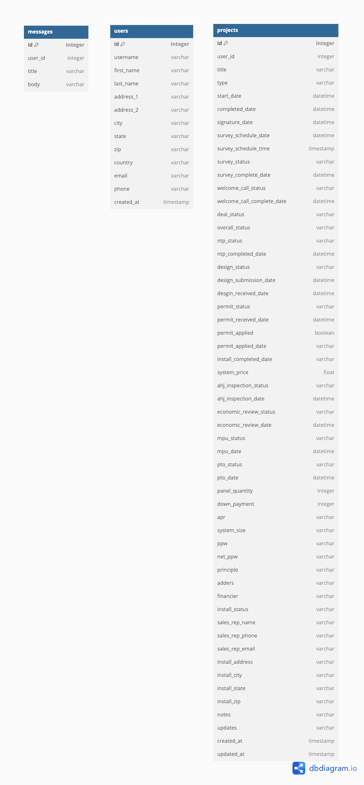

# Customer Portal

There are several programs used in the project.

* Node.js
* nextJs
* SST
* AWS
    *  S3
    *  DynamDB
    *  Cognito
* React
* Redux
* Html5
* Css
* Git
* Javascript


## API Documentation

## USER AUTHENTICATION/AUTHORIZATION

### All endpoints that require authentication

All endpoints that require a current user to be logged in.

* Request: endpoints that require authentication
* Error Response: Require authentication
  * Status Code: 401
  * Headers:
    * Content-Type: application/json
  * Body:

    ```json
    {
      "message": "Authentication required",
      "statusCode": 401
    }
    ```

### All endpoints that require proper authorization

All endpoints that require authentication and the current user does not have the
correct role(s) or permission(s).

* Request: endpoints that require proper authorization
* Error Response: Require proper authorization
  * Status Code: 403
  * Headers:
    * Content-Type: application/json
  * Body:

    ```json
    {
      "message": "Forbidden",
      "statusCode": 403
    }
    ```


### Log In a User
User: Home Owner

Logs in a current user with valid credentials and returns the current user's
information.

1. User opens up the web application with login screen with options to use Google/Facebook/Existing email account and clicks button of the service
2. User enters credentials and is brought to the user's HomePage

* Require Authentication: false
* Request
  * Method: POST
  * URL: /user/login
  * Headers:
    * Content-Type: application/json
  * Body:

    ```json
    {
      "credential": "steve.johnson@gmail.com",
      "password": "secret password"
    }
    ```

* Successful Response
  * Status Code: 200
  * Headers:
    * Content-Type: application/json
  * Body:

    ```json
    {
      "id": 1,
      "firstName": "Steve",
      "lastName": "Johnson",
      "email": "Steve.Johnson@gmail.com",
      "phone": "555-555-5555"
    }
    ```

* Error Response: Invalid credentials
  * Status Code: 401
  * Headers:
    * Content-Type: application/json
  * Body:

    ```json
    {
      "message": "Invalid credentials",
      "statusCode": 401
    }
    ```

* Error response: Body validation errors
  * Status Code: 400
  * Headers:
    * Content-Type: application/json
  * Body:

    ```json
    {
      "message": "Validation error",
      "statusCode": 400,
      "errors": {
        "credential": "Email or username is required",
        "password": "Password is required"
      }
    }
    ```

### Sign Up a User
User: Home Owner

Creates a new user, logs them in as the current user, and returns the current
user's information.

1. A new user opens up the web appicliation and clicks on the sign up button.
2. A sign up form page appears and the user inputs the information and submits. If successful the user is brought to the home screen and a welcome email is sent.
3. The user is brought to the homepage where they can view projects, create project, message customer service, view user info

* Require Authentication: false
* Request
  * Method: POST
  * URL: /user/signup
  * Headers:
    * Content-Type: application/json
  * Body:

    ```json
    {
      "firstName": "Steve",
      "lastName": "Johnson",
      "email": "Steve.Johnson@gmail.com",
      "phone": "555-555-5555",
      "password": "secret password"
    }
    ```

* Successful Response
  * Status Code: 200
  * Headers:
    * Content-Type: application/json
  * Body:

    ```json
    {
      "id": 1,
      "firstName": "Steve",
      "lastName": "Johnson",
      "email": "Steve.Johnson@gmail.com",
      "phone": "555-555-5555",
      "createdAt": "2021-11-19 20:39:36",
    }
    ```

* Error response: User already exists with the specified email
  * Status Code: 403
  * Headers:
    * Content-Type: application/json
  * Body:

    ```json
    {
      "message": "User already exists",
      "statusCode": 403,
      "errors": {
        "email": "User with that email already exists"
      }
    }
    ```

* Error response: User already exists with the specified username
  * Status Code: 403
  * Headers:
    * Content-Type: application/json
  * Body:

    ```json
    {
      "message": "User already exists",
      "statusCode": 403,
      "errors": {
        "username": "User with that username already exists"
      }
    }
    ```

* Error response: Body validation errors
  * Status Code: 400
  * Headers:
    * Content-Type: application/json
  * Body:

    ```json
    {
      "message": "Validation error",
      "statusCode": 400,
      "errors": {
        "email": "Valid email address is required",
        "phone": "Phone is required",
        "firstName": "First Name is required",
        "lastName": "Last Name is required",
        "password": "Password is required"
      }
    }
    ```

### Update a User
User: Home Owner/Admin

Updates and returns an existing user information

1. User logs in
2. User selects User Info and is sent to the user page
3. Back button, and Edit button, user clicks edit
4. User information form screen is shown, edits can be made and submitted. All fields must be populated
5. User is returned to User info page

* Require Authentication: true
* Require proper authorization: user must belong to the current user
* Request
  * Method: PUT
  * URL: /users/:userId/edit
  * Headers:
    * Content-Type: application/json
  * Body:

    ```json
    {
      "firstName": "Steve",
      "lastName": "Johnson",
      "email": "Steve.Johnson@gmail.com",
      "phone": "777-777-7777",
      "password": "secret password"
    }
    ```

* Successful Response
  * Status Code: 200
  * Headers:
    * Content-Type: application/json
  * Body:

    ```json
    
    {
      "id": 1,
      "firstName": "Steve",
      "lastName": "Johnson",
      "email": "Steve.Johnson@gmail.com",
      "phone": "777-777-7777",
      "updatedAt": "2023-11-20 20:00:00",
    }
    ```

* Error Response: Body validation error
  * Status Code: 400
  * Headers:
    * Content-Type: application/json
  * Body:

    ```json
    {
      "message": "Validation Error",
      "statusCode": 400,
      "errors": {
            "lastName": "Last name is required",
            "username": "First name is required",
            "email": "Email is required",
            "phone": "Phone number is required"
      }
    }
    ```

* Error response: Couldn't find a user with the specified id
  * Status Code: 404
  * Headers:
    * Content-Type: application/json
  * Body:

    ```json
    {
      "message": "user login credentials email/password couldn't be found",
      "statusCode": 404
    }
    ```


### Get the Current User
User: Customer Service


Returns the information about the current user that is logged in. For backend use to get informaiton about a specific customer.

* Require Authentication: true
* Request
  * Method: GET
  * URL: /user/:userId
  * Body: none

* Successful Response
  * Status Code: 200
  * Headers:
    * Content-Type: application/json
  * Body:

    ```json
    {
      "id": 1,
      "firstName": "Steve",
      "lastName": "Johnson",
      "email": "steve.johnson@gmail.com",
      "username": "SteveJohnson",
      "phone": "555-555-5555",

    }
    ```


## Projects

### Create A Project

1. Once user is logged in they are brought tot he hompage. 
2. Here they have the option to view current project or create a project
3. User selects create project and the project form pops up. 
4. User fills out the fields and submits
Creates and returns a new project.

* Require Authentication: true
* Request
  * Method: POST
  * URL: /projects/new
  * Headers:
    * Content-Type: application/json
  * Body:

    ```json
    {
        "fieldName": "WHAT FIELDS SHOULD BE EDITABLE AND ARE REQUIRED",
        "user inputs": "what does the user input and what inouts are defaulted and updated on OnPoint's side?"
    }
    ```

* Successful Response
  * Status Code: 201
  * Headers:
    * Content-Type: application/json
  * Body:

    ```json
    {
         {
      "id": 1,
      "itemId": 1,
      "name": "address + Username?",
      "address": "123 Happy Lane",
      "ownerEmail": "steve.johnson@gmail.com",
      "ownerPhone": "617-482-5988",
      "signatureDate": "default",
      "salesRep": "default",
      "surveyScheduleDate": "default",
      "surveyScheduleTime": "default",
      "surveyStatus": "default",
      "surveyCompleteDate":"default",
      "welcomeCallStatus": "default",
      "welcomeCallCompleteDate":"default",
      "dealStatus": "default",
      "overallStatus": "default",
      "ntpStatus": "default",
      "ntpCompletedDate": "default",
      "designStatus": "default",
      "designSubmittedDate": "default",
      "desiginReceivedDate": "default",
      "permitStatus": "default",
      "permitReceivedDate": "default",
      "permitApplied":"default",
      "permitAppliedDate": "default",
      "installStatus": "default",
      "installCompletedDate": "default",
      "systemPrice": "default",
      "ahjInspectionStatus": "default",
      "ahjInspectionDate": "default",
      "economicReviewStatus": "default",
      "economicReviewDate": "default",
      "mpuStatus": "default",
      "mpuDate": "default",
      "ptoStatus": "default",
      "ptoDate": "default",
      "panelQty": "default",
      "leadSource": "default",
      "setter": "default",
      "redline": "default",
      "systemPrice": "default",
      "downPayment": "default",
      "dealerPercentage": "default",
      "dealerFeeAmount": "default",
      "mp1": "default",
      "systemSize": "default",
      "adders": "default",
      "principle": "default",
      "netAdditional": "default",
      "PPW": "default",
      "netPPW": "default",
      "addersTotal": "default",
      "updates": "default",
    }
    }
    ```

* Error Response: Body validation error
  * Status Code: 400
  * Headers:
    * Content-Type: application/json
  * Body:

    ```json
    {
      "message": "Validation Error",
      "statusCode": 400,
      "errors": {
        "title": "project {field} is required"
      }
    }
    ```


### Get Projects based on User

User: Home Owner

Returns all the projects created by the current user.

1. User signs in from the login page
2. If successful the user is brought to the Welcome Homepage. From here you can select your projects, messages, account info. 
3. User clicks projects and is brought to the projects page where their project is displayed or if no project they are prompted to create a project.


* Require Authentication: true
* Request
  * Method: GET
  * URL: /user/:userId/projects
  * Body: none

* Successful Response
  * Status Code: 200
  * Headers:
    * Content-Type: application/json
  * Body:

    ```json
    {
      "Projects": [
        {
      "id": 1,
      "itemId": 1,
      "name": "address + Username?",
      "address": "123 Happy Lane",
      "email": "steve.johnson@gmail.com",
      "phone": "617-482-5988",
      "signatureDate": "default",
      "salesRep": "default",
      "surveyScheduleDate": "default",
      "surveyScheduleTime": "default",
      "surveyStatus": "default",
      "surveyCompleteDate":"default",
      "welcomeCallStatus": "default",
      "welcomeCallCompleteDate":"default",
      "dealStatus": "default",
      "overallStatus": "default",
      "ntpStatus": "default",
      "ntpCompletedDate": "default",
      "designStatus": "default",
      "designSubmittedDate": "default",
      "desiginReceivedDate": "default",
      "permitStatus": "default",
      "permitReceivedDate": "default",
      "permitApplied":"default",
      "permitAppliedDate": "default",
      "installStatus": "default",
      "installCompletedDate": "default",
      "systemPrice": "default",
      "ahjInspectionStatus": "default",
      "ahjInspectionDate": "default",
      "economicReviewStatus": "default",
      "economicReviewDate": "default",
      "mpuStatus": "default",
      "mpuDate": "default",
      "ptoStatus": "default",
      "ptoDate": "default",
      "panelQty": "default",
      "leadSource": "default",
      "setter": "default",
      "redline": "default",
      "systemPrice": "default",
      "downPayment": "default",
      "dealerPercentage": "default",
      "dealerFeeAmount": "default",
      "mp1": "default",
      "systemSize": "default",
      "adders": "default",
      "principle": "default",
      "netAdditional": "default",
      "PPW": "default",
      "netPPW": "default",
      "addersTotal": "default",
      "updates": "default",
    }
      ]
    }
    ```

### Update Project Information - User?
User: Home Owner/Admin

Updates and returns project editable information

1. User logs in
2. User selects Projects  and is sent to the project page
3. User can view project status or edit project
4. Edits to specific info can be made and submitted. 
5. User is returned to Project Status page

* Require Authentication: true
* Require proper authorization: project must belong to the current user
* Request
  * Method: PUT
  * URL: /users/:userId/projects/edit
  * Headers:
    * Content-Type: application/json
  * Body:

    ```json
    {
      "fieldName": "WHAT FIELDS SHOULD BE EDITABLE AND ARE REQUIRED",
      "project": "Project name",

    }
    ```

* Successful Response
  * Status Code: 200
  * Headers:
    * Content-Type: application/json
  * Body:

    ```json
    
         {
      "id": 1,
      "itemId": 1,
      "name": "address + Username?",
      "address": "123 Happy Lane",
      "ownerEmail": "steve.johnson@gmail.com",
      "ownerPhone": "617-482-5988",
      "signatureDate": "default",
      "salesRep": "default",
      "surveyScheduleDate": "default",
      "surveyScheduleTime": "default",
      "surveyStatus": "default",
      "surveyCompleteDate":"default",
      "welcomeCallStatus": "default",
      "welcomeCallCompleteDate":"default",
      "dealStatus": "default",
      "overallStatus": "default",
      "ntpStatus": "default",
      "ntpCompletedDate": "default",
      "designStatus": "default",
      "designSubmittedDate": "default",
      "desiginReceivedDate": "default",
      "permitStatus": "default",
      "permitReceivedDate": "default",
      "permitApplied":"default",
      "permitAppliedDate": "default",
      "installStatus": "default",
      "installCompletedDate": "default",
      "systemPrice": "default",
      "ahjInspectionStatus": "default",
      "ahjInspectionDate": "default",
      "economicReviewStatus": "default",
      "economicReviewDate": "default",
      "mpuStatus": "default",
      "mpuDate": "default",
      "ptoStatus": "default",
      "ptoDate": "default",
      "panelQty": "default",
      "leadSource": "default",
      "setter": "default",
      "redline": "default",
      "systemPrice": "default",
      "downPayment": "default",
      "dealerPercentage": "default",
      "dealerFeeAmount": "default",
      "mp1": "default",
      "systemSize": "default",
      "adders": "default",
      "principle": "default",
      "netAdditional": "default",
      "PPW": "default",
      "netPPW": "default",
      "addersTotal": "default",
      "updates": "default",
    }
    ```

* Error Response: Body validation error
  * Status Code: 400
  * Headers:
    * Content-Type: application/json
  * Body:

    ```json
    {
      "message": "Validation Error",
      "statusCode": 400,
      "errors": {
            "fieldName": "WHAT FIELDS SHOULD BE EDITABLE AND ARE REQUIRED",

      }
    }
    ```

* Error response: Couldn't find a user with the specified id
  * Status Code: 404
  * Headers:
    * Content-Type: application/json
  * Body:

    ```json
    {
      "message": "user login credentials email/password couldn't be found",
      "statusCode": 404
    }
    ```


### Update Project Information - OnPoint


## Database Schema Design
For a visual you can go to 	[Db Diagram](https://dbdiagram.io/) and test out how you want your schema to look.


